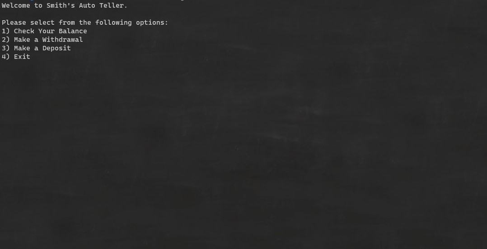
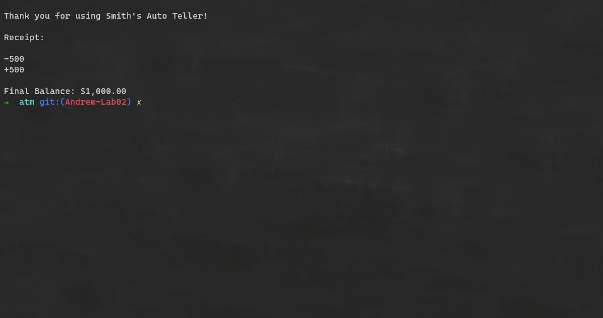

# ATM
---

Lab02-Unit Tests and Documentation

*Author: Andrew Smith*

---

# Description
---

This is a .NET Core C# console application that acts as an digital automated teller machine.
The user is first greeted and then given an 4 options: 1) View Balance, 2) Make Withdrawal, 
3) Make a Deposit, 4) Exit the ATM. The user will be redirected back the options menu when
he/she finishes with options 1, 2 or 3. 

---

## Getting Started

Clone down this repository:

`$ git clone [repo url]`

Then navigate to `Lab02-ATM -> ATM ->` and run `dotnet run .\Program.cs`

---

## Visuals

Application start

Make a withdrawal

Make a deposit

Exit the application

---

## Change Log

*empty*